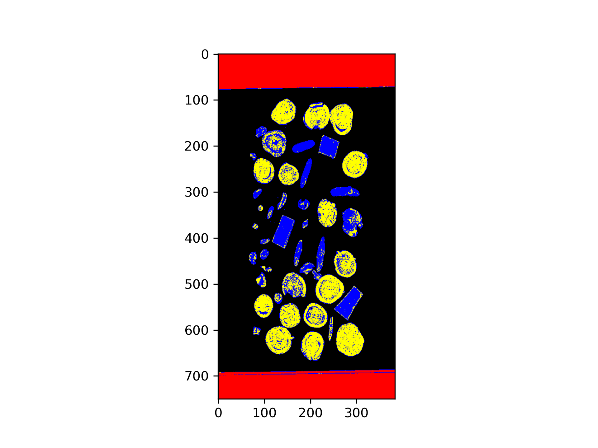
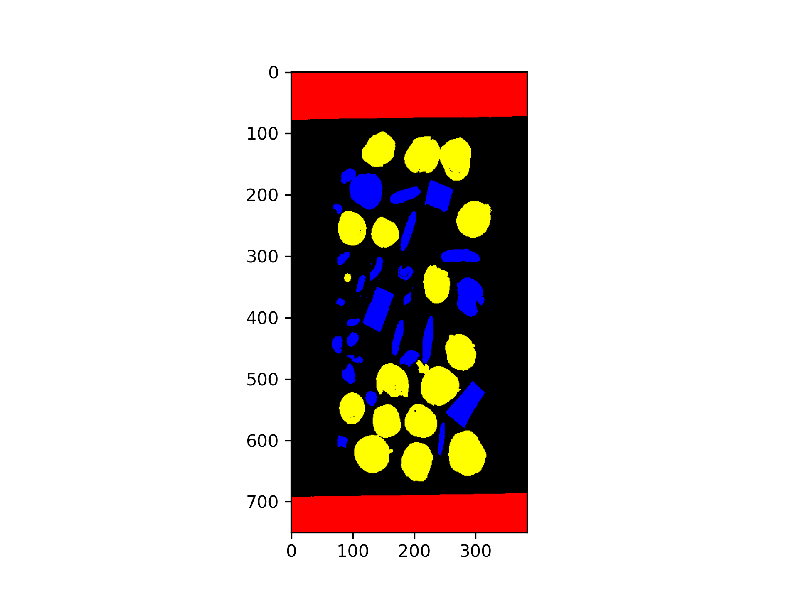

# 黄芪分拣项目

2023年6月开始开发的项目

## 整体结构

   ```text
    Astragalin
    ├── README.md
    ├── data
    ├── models
    ├── classifer.py
    ├── main.py
    ├── utils.py
```
高光谱图像数据集放在data文件夹下，模型放在models文件夹下，classifer.py是分类器，main.py是主程序，utils.py是工具函数。

## 谱段选择

已给的高光谱图像有288个谱段，但是我们只需要用前110个谱段，并且在其中进行特征谱段优选

采用SelectKBest进行谱段选择，选择的方法是卡方检验，选择的谱段数目是10个，选择的谱段如下所示：

    [ 91  92  93  94  95  96  97  98  99 100]

## 模型训练

通过多个模型比较发现决策树的效果最优

所以采用的模型是DecisionTree，random_state=65，权重默认

将训练好的模型保存在models文件夹下

## 预测

读取data文件夹下的数据，进行预测

对不同类别进行颜色区分，分别用黑色表示背景、红色表示杂质1、绿色表示杂质2、蓝色表示黄芪、黄色表示甘草片、紫色表示红芪

对01newrawfile_ref.raw进行预测，结果如下所示：



## 连通域分析

对预测结果进行连通域分析，将个别像素的误识别进行剔除，结果如下所示：



## 通讯协议

OSI5~7层，基于单播TCP/IP，一包数据由8'haa打头，8'hbb结束，共6个字段：

| 起始  | 长度1 | 长度2 | 长度3 | 长度4 | 类型1 | 类型2 | 类型3 | 类型4 | 数据1 | 数据2 | ...  | 数据i | 校验1 | 校验2 | 结束  |
| :---: | :---: | :---: | :---: | :---: | :---: | :---: | :---: | :---: | :---: | :---: | :--: | :---: | :---: | :---: | :---: |
| 8'haa | 8'hzz | 8'hzz | 8'hzz | 8'hzz | 8'hzz | 8'hzz | 8'hzz | 8'hzz | 8'hzz | 8'hzz | ...  | 8'hzz | 8'hff | 8'hff | 8'hbb |

### 起始

1字节，8'haa

### 长度

一个32位无符号数length，长度 = 数据字节数i + 4 。<br>`长度1`指length[31:24]，`长度2`指length[23:16]，`长度3`指length[15:8]，`长度4`指length[7:0]

### 类型&数据

ASCII字符，比如`类型1`为' '(空格)，`类型2`为' '(空格)，`类型3`为'I'，`类型4`为'M'，代表图像数据包

- **图像数据包' '' ''I''M'**，`数据1`~`数据i`包含了图像的行数rows、列数cols、谱段bands，$i-4=rows \times cols \times 3$具体如下：

  | 行数1      | 行数2     | 列数1      | 列数2     | 谱段1         | 谱段2        | 图像数据1 | ...  | 图像数据(i-4) |
  | ---------- | --------- | ---------- | --------- |-------------|------------| --------- | ---- | ------------- |
  | rows[15:8] | rows[7:0] | cols[15:8] | cols[7:0] | bands[15:8] | bands[7:0] |           | ...  |               |

  （此处设计在实际使用中吴大佬并未使用）接收方应当在收到图像数据包后发送' ''A''I''M'包表示已经收到，如下：

  | 起始  | 长度1 | 长度2 | 长度3 | 长度4 | 类型1 | 类型2 | 类型3 | 类型4 | 数据1 | 校验1 | 校验2 | 结束  |
  | :---: | :---: | :---: | :---: | :---: | :---: | :---: | :---: | :---: | :---: | :---: | :---: | :---: |
  | 8'haa | 8'd0  | 8'd0  | 8'd0  | 8'd5  |  ' '  |  'A'  |  'I'  |  'M'  | 8'hff | 8'hff | 8'hff | 8'hbb |

  图像数据包的接收方应当在完成预测后发送包含预测结果`数据1`的' ''D''I''M'包，如下：

  | 起始  | 长度1 | 长度2 | 长度3 | 长度4 | 类型1 | 类型2 | 类型3 | 类型4 |  数据   | 校验1 | 校验2 | 结束  |
  | :---: | :---: | :---: | :---: | :---: | :---: | :---: | :---: | :---: |:-----:| :---: | :---: | :---: |
  | 8'haa | 8'd0  | 8'd0  | 8'd0  | 8'd5  |  ' '  |  'D'  |  'I'  |  'M'  | 预测结果  | 8'hff | 8'hff | 8'hbb |

    数据中每一个中心点坐标的格式为：
   

   | 横坐标 | 纵坐标 | 标签类型    | 分隔符号         |
   |-----|-----|---------|--------------|
   | x,  | y,  | labels, | <code>&#124; |

### 校验

2字节，`校验1`为8'hff，`校验2`为8'hff

### 结束

1字节，8'hbb


